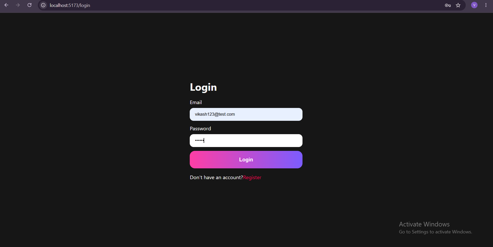
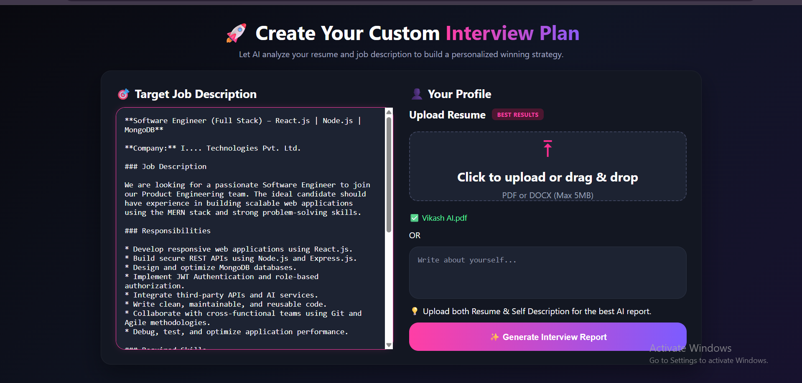

# 🚀 AI-Powered Job Preparation & Resume Analyzer

An AI-powered Full Stack Web Application that analyzes a candidate's resume and target job description to generate personalized interview preparation reports using **Google Gemini AI**. The platform helps users identify skill gaps, prepare technical and behavioral interview questions, and receive a customized learning roadmap.

> 🚧 **Project Status:** Under Active Development. New features are continuously being added.

---

# ✨ Features

- 🔐 User Authentication (Login & Registration)
- 🛡️ JWT Protected Routes
- 📄 Resume Upload (PDF/DOCX)
- 💼 Target Job Description Analysis
- 🤖 AI-Powered Interview Preparation
- 📊 Skill Gap Analysis
- 🛣️ Personalized Learning Roadmap
- 📑 Dynamic Interview Report
- 🎨 Modern Dark UI
- 📱 Responsive Design

---

# 📸 Application Screenshots

## 🔐 Login Page

<p align="center">

</p>

---

## 🏠 Home Dashboard

<p align="center">

</p>

---

# 🛠️ Tech Stack

### Frontend

- React.js
- React Router DOM
- SCSS
- Axios

### Backend

- Node.js
- Express.js
- MongoDB
- Mongoose
- JWT Authentication
- Multer

### AI Integration

- Google Gemini API

### Tools

- Git & GitHub
- VS Code
- MongoDB Compass
- Postman

---

# 📂 Project Structure

```text
AI-Job-Prep-Genai-App
│
├── Backened
│   ├── src
│   ├── server.js
│   ├── package.json
│   └── ...
│
├── Fronted
│   ├── src
│   ├── public
│   ├── package.json
│   └── ...
│
├── Images
│   ├── login.png
│   ├── home.png
│   └── .gitkeep
│
└── README.md
```

---

# ⚙️ Installation

## Clone Repository

```bash
git clone https://github.com/VikashSingh81/AI-Job-Prep-Genai-App.git
```

Move inside the project

```bash
cd AI-Job-Prep-Genai-App
```

### Backend

```bash
cd Backened
npm install
npm run dev
```

### Frontend

```bash
cd Fronted
npm install
npm run dev
```

---

# 🔑 Environment Variables

Create a `.env` file inside the **Backened** folder.

```env
PORT=3000

MONGO_URI=YOUR_MONGODB_CONNECTION_STRING

JWT_SECRET=YOUR_SECRET_KEY

GEMINI_API_KEY=YOUR_GEMINI_API_KEY
```

---

# 🚀 Current Progress

### ✅ Completed

- User Registration
- User Login
- JWT Authentication
- Protected Routes
- Resume Upload Interface
- Job Description Input
- Responsive UI
- MongoDB Integration
- Gemini AI Integration
- Interview Report UI Design

### 🚧 In Progress

- AI Interview Report Generation
- Dynamic Technical Questions
- Behavioral Questions
- Skill Gap Detection
- Learning Roadmap
- Match Score Generation

### 📌 Upcoming Features

- Download Report as PDF
- Interview History
- ATS Resume Score
- Company Specific Interview Preparation
- Mock Interview Module
- Dashboard Analytics

---

# 🎯 Project Objective

The main goal of this project is to simplify interview preparation by combining **Resume Analysis**, **Job Description Matching**, and **Generative AI** to provide personalized interview guidance and improve placement readiness.

---

# 👨‍💻 Author

### Vikash Kumar Singh

- GitHub: https://github.com/VikashSingh81
- LinkedIn: https://www.linkedin.com/in/vikashsingh89/

---

# ⭐ Support

If you found this project helpful, consider giving it a ⭐ on GitHub.

It motivates me to build more useful open-source projects.
